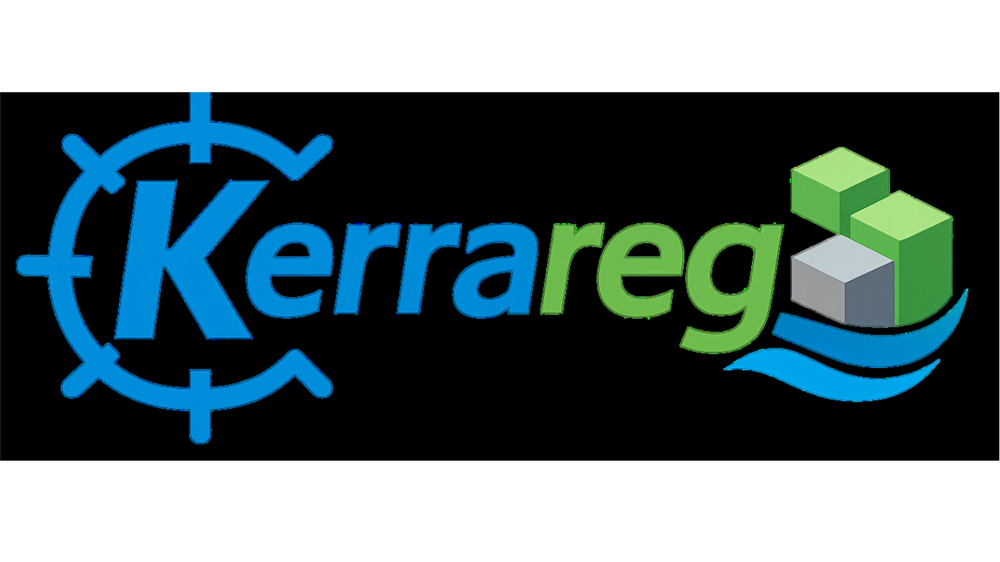
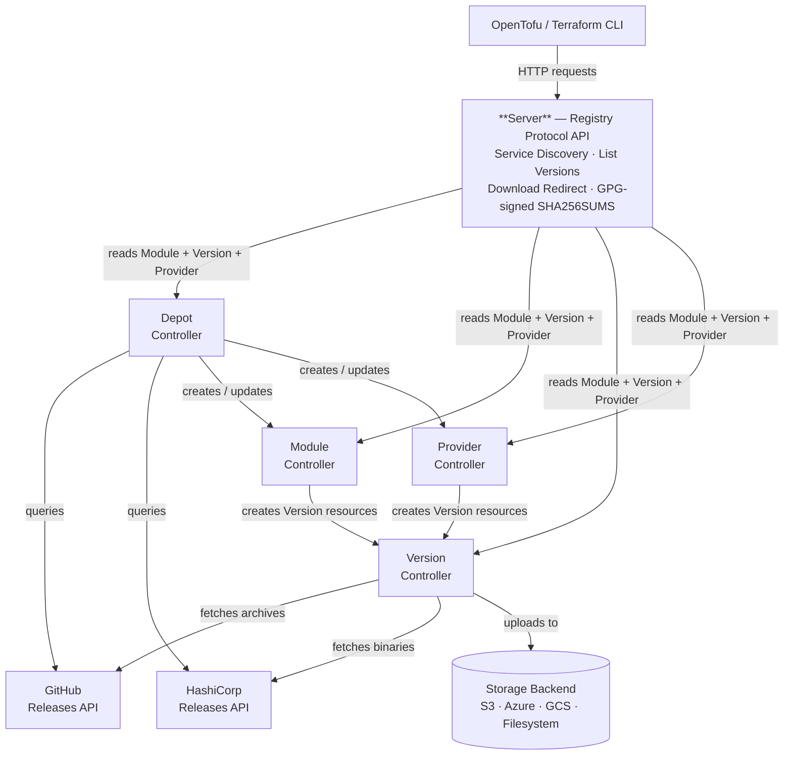

[](https://go.dev/)
[](https://github.com/tonedefdev/kerrareg/blob/main/LICENSE)
[](https://github.com/tonedefdev/kerrareg/tree/main/chart/kerrareg)

<p align="center">
  
</p>

A Kubernetes-native, self-hosted OpenTofu/Terraform module and provider registry. Kerrareg gives organizations complete control over module distribution, versioning, and storage — without relying on the public registry.

Compatible with **OpenTofu** (all versions) and **Terraform** (v1.2+).

## Why Kerrareg?

There are several open-source Terraform/OpenTofu module registries. They're good projects, but they all share a common challenge: **authentication and authorization are bolted on**. Most require you to stand up a separate database, configure API keys or OAuth flows, and manage user accounts outside of your infrastructure platform.

Kerrareg takes a fundamentally different approach. Instead of reinventing auth, it delegates it entirely to Kubernetes — the platform you're likely already running!

### Security First

| Capability | Kerrareg | Traditional Registries |
|-----------|----------|------------------------|
| **Authentication** | Kubernetes bearer tokens or kubeconfig — no proprietary tokens, no user database | API keys, OAuth, or basic auth requiring a separate identity store |
| **Authorization** | Kubernetes RBAC — namespace-scoped roles control who can read, publish, or admin modules | Custom permission models, often coarse-grained or application-level only |
| **Token Lifecycle** | Short-lived, auto-rotating tokens via `aws eks get-token`, `gcloud auth`, or `az account get-access-token` | Long-lived API keys that must be manually rotated |
| **Audit Trail** | Kubernetes audit logs capture every API call with user identity, verb, and resource | Varies — often requires additional logging configuration |
| **Zero Additional Infrastructure** | No database, no Redis, no external IdP integration | Typically requires PostgreSQL, MySQL, or SQLite plus session management |

Because Kerrareg uses Kubernetes ServiceAccounts and RBAC natively, your existing identity federation (IRSA on EKS, Workload Identity on GKE/AKS, or any OIDC provider) works out of the box. There's nothing extra to configure — if a user or CI pipeline can authenticate to your cluster, they can authenticate to Kerrareg.

### Desired State Reconciliation

Traditional registries are imperative: you push a module or provider version via an API call, and the registry stores it. If something goes wrong — a failed upload, a corrupted archive, a storage outage — you have to detect and remediate it yourself.

Kerrareg is **declarative**. You describe the modules/providers and versions you want, and Kubernetes controllers continuously reconcile toward that desired state:

- **Self-healing:** If a Version resource fails to sync, the controller retries with exponential backoff. Transient GitHub, network, or storage errors resolve automatically.
- **Idempotent:** Applying the same Module/Provider manifest twice is a no-op. Controllers only act on drift.
- **Garbage collection:** Remove a version from `spec.versions` and the controller cleans up the Version resource and its storage artifact.
- **Immutability enforcement:** When `immutable: true` is set, the controller validates checksums on every reconciliation — not just at upload time.

This is the same operational model that makes Kubernetes itself reliable, applied to your OpenTofu registry.

### Tamper-Resistant Checksums

Most registries compute a checksum when a module is uploaded and verify it on download — but that single point of validation leaves a window for tampering. If someone replaces the artifact in storage, the registry has no way to detect the change.

Kerrareg takes a stronger approach. When a Version controller first discovers a module artifact, it computes the checksum and writes it to the Version resource's **`.status`** field. Kubernetes exposes status as a separate subresource (`versions/status`), and Kerrareg's RBAC only grants write access to the Version controller's ServiceAccount — users, CI pipelines, and `kubectl edit` cannot modify it unless explicitly given access to it. On every subsequent reconciliation, the controller compares the storage artifact's checksum against this recorded status value. If the checksums diverge, the controller flags the version as tampered and refuses to serve it.

This means an attacker who gains write access to your storage backend still can't silently swap a module archive. The checksum of record lives in the Kubernetes API, is protected by Kubernetes RBAC, and is verified continuously — not just once at upload time.

### How Kerrareg Compares

| Feature | Kerrareg | Terrareg | Tapir |
|---------|----------|----------|-------|
| Auth mechanism | Kubernetes RBAC + bearer tokens | API keys + SAML/OpenID Connect | API keys |
| Database required | No (Kubernetes API is the datastore) | Yes (PostgreSQL/MySQL/SQLite) | Yes (MongoDB/PostgreSQL) |
| Deployment model | Helm chart, runs on any Kubernetes cluster | Docker Compose or standalone | Docker Compose or standalone |
| Self-healing | Yes (controller reconciliation loop) | No | No |
| Multi-cloud storage | S3, Azure Blob, GCS, Filesystem | S3, Filesystem | S3, GCS, Filesystem |
| Version discovery | Automatic via Depot (GitHub Releases API for modules, HashiCorp Releases API for providers) | Manual upload or API push | Manual upload or API push |
| Immutability enforcement | Checksum validated every reconciliation | At upload time only | At upload time only |
| Air-gapped support | Yes (filesystem backend + PVC) | Yes (filesystem) | Limited |

!!! tip
    If you're already running Kubernetes, Kerrareg gives you a module registry where security, auth, and operations come free — no extra infrastructure, no extra accounts, no extra attack surface.

## How It Works

When you reference a module in your OpenTofu configuration:

```hcl
module "eks" {
  source  = "kerrareg.defdev.io/kerrareg-system/terraform-aws-eks/aws"
  version = "~> 21.0"
}
```

OpenTofu uses the Module Registry Protocol to:

1. **Discover** the registry API via `/.well-known/terraform.json`
2. **List versions** matching your constraint (`~> 21.0`)
3. **Download** the module archive from the configured storage backend

Kerrareg implements all required protocol endpoints, making it a drop-in replacement for any public or private module registry.


## Architecture

Kerrareg consists of four services running in Kubernetes:



See [Architecture](architecture.md) for a detailed description of each service and the reconciliation event flow.

## How Kerrareg Compares

| Feature | Kerrareg | Terrareg | Tapir |
|---------|----------|----------|-------|
| Auth mechanism | Kubernetes RBAC + bearer tokens | API keys + SAML/OpenID Connect | API keys |
| Database required | No (Kubernetes API is the datastore) | Yes (PostgreSQL/MySQL/SQLite) | Yes (MongoDB/PostgreSQL) |
| Deployment model | Helm chart, runs on any Kubernetes cluster | Docker Compose or standalone | Docker Compose or standalone |
| Self-healing | Yes (controller reconciliation loop) | No | No |
| Multi-cloud storage | S3, Azure Blob, GCS, Filesystem | S3, Filesystem | S3, GCS, Filesystem |
| Version discovery | Automatic via Depot (GitHub Releases API for modules, HashiCorp Releases API for providers) | Manual upload or API push | Manual upload or API push |
| Immutability enforcement | Checksum validated every reconciliation | At upload time only | At upload time only |
| Air-gapped support | Yes (filesystem backend + PVC) | Yes (filesystem) | Limited |

!!! tip
    If you're already running Kubernetes, Kerrareg gives you a module registry where security, auth, and operations come free — no extra infrastructure, no extra accounts, no extra attack surface.

## Next Steps

- **[Getting Started: Installation](getting-started/installation.md)** — deploy Kerrareg with Helm in minutes
- **[Getting Started: Local Quickstart](getting-started/quickstart.md)** — run a fully functional registry on your laptop with `kind`
- **[Architecture](architecture.md)** — understand how the four services interact
- **[Storage Backends](storage.md)** — S3, Azure Blob, GCS, and local filesystem
- **[Guides](guides/gitops.md)** — GitOps, CI/CD, Depot, provider consumption, and migration workflows

## License

Apache License 2.0. See [LICENSE](https://github.com/tonedefdev/kerrareg/blob/main/LICENSE) for details.
