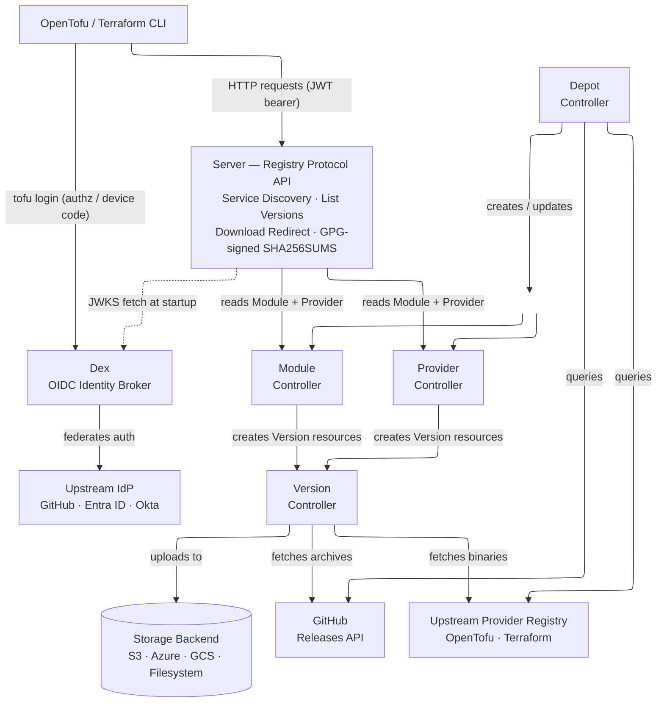

## Why OpenDepot?

Most self-hosted Terraform/OpenTofu registries ask you to run and maintain more than the registry itself — an external database, a separate identity provider, or both. OpenDepot is built to avoid that: it's **free, open source, and Kubernetes-native**, with vulnerability scanning, automatic version discovery, a comprehensive User Interface, and OIDC-based SSO included out of the box.

The server and UI is read-only by design, and Kubernetes RBAC remains the authorization layer for create, update, and delete operations. Deployment requires nothing beyond a Helm chart and a storage backend.

- :material-view-dashboard-outline: &nbsp;__Registry Explorer UI__

    ---

    Browse and search modules, providers, versions, READMEs, vulnerability findings, depot relationships, and download statistics from one interface. See the [Registry Explorer guide](guides/registry-explorer.md) or [walk through the UI, Dex SSO, and GroupBinding access control](https://www.defdev.io/blog/ui-sso-in-opendepot).

- :material-login: &nbsp;__OIDC Single Sign-On (SSO)__

    ---

    First-class support for the OpenTofu login flow via the bundled [Dex](https://dexidp.io/) subchart. Connect any OIDC-compatible identity provider — GitHub, Entra ID, Okta, or static passwords — and let `tofu login` handle credential acquisition automatically.

- :material-tag-check: &nbsp;__Automatic Discovery & Provider Mirroring__

    ---

    The Depot controller discovers module releases and provider versions from their configured upstream registries. Use the [Provider Network Mirror Protocol](guides/providers.md#default-workflow-network-mirror) to install mirrored providers through OpenDepot while keeping canonical provider source addresses unchanged in module configurations and lockfiles.

- :material-shield-check: &nbsp;__Security First__

    ---

    OIDC is the preferred authentication path (via Dex and your upstream IdP), while the server stays read-only by design. Kubernetes RBAC authorizes create, update, and delete operations — no proprietary tokens, no user database, no extra identity store.

- :material-database-off: &nbsp;__No External Database__

    ---

    The Kubernetes API stores registry state, while the bundled Valkey instance persists download statistics. No separately managed application database is required.

- :material-cloud-check: &nbsp;__Multi-Cloud Storage__

    ---

    S3, Azure Blob, Google Cloud Storage, and local filesystem — all supported out of the box with SDK-native authentication chains.

- :material-shield-refresh: &nbsp;__Self-Healing & Tamper Resistance__

    ---

    Declarative controllers continuously reconcile toward desired state and retry transient failures. For immutable versions, RBAC-protected checksums are verified on every reconciliation to detect artifact replacement.

- :material-magnify-scan: &nbsp;__Built-In Vulnerability Scanning__

    ---

    The Version controller runs [Trivy](https://trivy.dev/) automatically on every provider binary, provider source (`go.mod`), and module archive. Findings are stored on the Kubernetes resource and can optionally block promotion of critical or high severity artifacts.

- :material-link-variant: &nbsp;__Zero-Egress Provider Downloads__

    ---

    Enable pre-signed URL redirects so OpenTofu and Terraform fetch provider binaries directly from S3, GCS, or Azure Blob — no bandwidth through the server, no extra hops, no infrastructure bottleneck.

## How OpenDepot Compares

| Feature                  | OpenDepot (OSS)         | HCP Terraform Registry      | JFrog Artifactory         | GitLab Terraform Registry | Harbor / OCI Registry      | Terrarium / Tapir / Hermit (OSS) |
|--------------------------|-------------------------|----------------------------|---------------------------|--------------------------|----------------------------|-----------------------------------|
| **License**              | Apache 2.0 (Free, OSS)  | Commercial SaaS/Enterprise | Commercial (Paid)         | GitLab EE/CE (Mixed)     | Apache 2.0 (OSS)           | OSS (varies)                      |
| **Auth**                 | K8s RBAC + OIDC (Dex)   | HCP tokens, SSO            | Artifactory tokens, SSO   | GitLab users             | Registry users/OIDC         | API keys, basic auth              |
| **Database Required**    | No external DB (K8s API + bundled Valkey) | SaaS-managed/PostgreSQL    | Yes (external DB)         | Yes                      | Yes                         | Yes                               |
| **Deployment**           | Helm chart, K8s-native  | SaaS / Enterprise on-prem  | Docker/K8s/VM             | SaaS or self-hosted      | Docker/K8s                  | Docker/K8s                        |
| **Self-healing**         | Yes (controller loop)   | Partial (SaaS-managed)     | No                        | No                       | No                          | No                                |
| **Multi-cloud Storage**  | S3, Azure, GCS, FS      | SaaS-managed               | S3, Azure, GCS            | S3, GCS, Filesystem      | S3, GCS, Azure, Filesystem  | S3, GCS, Filesystem               |
| **Version Discovery**    | Automatic (GitHub/upstream registry) | VCS-connected/manual | Manual upload/API         | Manual/CI                | Manual/CI                   | Manual upload                     |
| **Immutability**         | Checksum every reconcile| At upload only             | Repo-level flag           | At upload only           | At upload only              | At upload only                    |
| **Air-gapped Support**   | Yes (FS + PVC)          | Enterprise only            | Yes                       | Yes                      | Yes                         | Yes                               |
| **Vuln Scanning**        | Built-in (Trivy)        | No                         | Paid add-on (Xray)        | No                       | No                          | No                                |
| **Pre-signed URLs**      | Yes (S3, GCS, Azure)    | No                         | Yes (CDN)                 | No                       | No                          | No                                |
| **Provider Support**     | Yes                     | Yes                        | Yes                       | No                       | No                          | No (modules only)                 |
| **`tofu login` Flow**    | Yes (Dex, `login.v1`)   | Yes                        | Yes                       | No                       | No                          | No                                |
| **Open Source**          | Yes                     | No                         | No                        | Partial                  | Yes                         | Yes                               |

!!! tip
    If you're already running Kubernetes, OpenDepot gives you automatic version discovery, built-in vulnerability scanning, and Kubernetes-native auth without adding a license fee or a new piece of infrastructure to operate.

## How It Works

```mermaid
%%{init: {'flowchart': {'defaultRenderer': 'elk'}} }%%
graph TD
    CLI["OpenTofu / Terraform CLI"]

    Server["Server — Registry Protocol API\nService Discovery · List Versions\nDownload Redirect · GPG-signed SHA256SUMS"]

    Dex["Dex\nOIDC Identity Broker"]
    IdP["Upstream IdP\nGitHub · Entra ID · Okta"]

    Depot["Depot\nController"]
    SyncBus[" "]:::hidden
    Module["Module\nController"]
    Provider["Provider\nController"]
    Version["Version\nController"]

    Storage[("Storage Backend\nS3 · Azure · GCS · Filesystem")]

    GitHub["GitHub\nReleases API"]
    ProviderRegistry["Upstream Provider Registry\nOpenTofu · Terraform"]

    CLI -->|"tofu login (authz / device code)"| Dex
    Dex -->|"federates auth"| IdP
    Server -.->|"JWKS fetch at startup"| Dex

    CLI -->|"HTTP requests (JWT bearer)"| Server
    Server -->|"reads Module + Provider"| Module & Provider

    Depot -->|queries| GitHub
    Depot -->|queries| ProviderRegistry
    Depot -->|creates / updates| SyncBus
    SyncBus --> Module
    SyncBus --> Provider

    Module -->|creates Version resources| Version
    Provider -->|creates Version resources| Version

    Version -->|fetches archives| GitHub
    Version -->|fetches binaries| ProviderRegistry
    Version -->|uploads to| Storage

    classDef hidden fill:none,stroke:none,color:transparent;
```

See [Architecture](architecture.md) for a detailed description of each controller and the full reconciliation event flow.

## Next Steps

- :material-rocket-launch: &nbsp;[__Install with Helm__](getting-started/installation.md)

    Deploy OpenDepot to your cluster in minutes.

- :material-laptop: &nbsp;[__Local Quickstart__](getting-started/quickstart.md)

    Run a fully functional registry locally with `kind` — no cloud account needed.

- :material-sitemap: &nbsp;[__Architecture__](architecture.md)

    Understand how the four services interact and reconcile.

- :material-book-open-variant: &nbsp;[__Guides__](guides/index.md)

    GitOps, CI/CD, Depot, provider consumption, and migration workflows.

